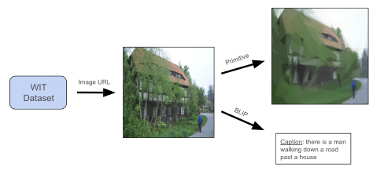
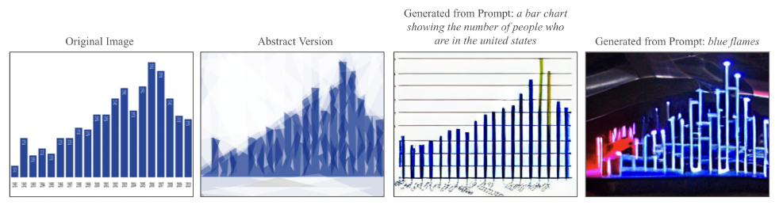

# Abstract Art Interpretation Using ControlNet

```Authors: Rishabh Srivastava (rs4489@columbia.edu), Addrish Roy (ar4613@columbia.edu)```

## 1. Introduction
The project demonstrates the potential of integrating abstract art interpretation with text-to-image synthesis using ControlNet. By introducing geometric primitives as conditions, we enable finer control over image generation, paving the way for more nuanced artistic expression.
By leveraging ControlNet, which integrates diverse conditioning inputs with Stable Diffusion, we introduce a novel condition crafted from geometric primitives to guide image generation.

A detailed analysis is present in the pdf file [Report.pdf](Report.pdf).

## 2. Methodology

### 2.1. Dataset Preparation
The dataset was curated from the [1% data sample file](https://storage.googleapis.com/gresearch/wit/wit_v1.train.all-1percent_sample.tsv.gz) of the [Wikipedia-based Image Text (WIT)](https://github.com/google-research-datasets/wit/blob/main/DATA.md) Dataset. Captions for images were generated using the BLIP model. Control images were derived using the Primitive software, resulting in a dataset of 14,279 pairs of control and target images with captions.

**Note**: If you want to create the dataset on your own, download the data sample zip file, unzip it, and rename the file obtained to `data.tsv` before running the Python notebook `create_dataset.ipynb` to generate the dataset. You need to install [Primitive](https://github.com/fogleman/primitive) in your command line if you want to generate a similar dataset for yourself or generate the control image for an image of your own. Primitive helps you convert your images to abstract images using geometric primitives like triangles.

<figure>
    <figcaption><b>Representation of our dataset generation pipeline</b></figcaption>
    
</figure>

### 2.2. ControlNet Architecture
ControlNet integrates additional conditions into the main neural network block, allowing for fine control over the image generation process. The architecture involves locking the original block parameters and creating a trainable duplicate linked with zero convolution layers.

### 2.3. Training
The model was trained on a subset of the dataset using an Nvidia T4 GPU. The training process involved initializing a pre-trained model, setting up a DataLoader, and iteratively processing image-text pairs to optimize the model's parameters.

The training dataset can be found [here](https://www.kaggle.com/datasets/rishabhsrivastava66/images-made-up-of-geometric-shapes-controlnet/data). Make sure the folder structure looks like this - 

    training
    ├── geometricShapes14k
        ├── prompt.json
        ├── source
        ├── target


### 2.4. Inference
The trained model can generate new images by inputting a sample abstract image and a prompt. While the model can function without prompts, its performance is optimized when prompts are provided.

The final model can be found on Huggingface - [control_sd15_ini10_10__myds.pth](https://huggingface.co/rishabhs66/ControlNet-Conditioned-On-Geometric-Shapes/blob/main/control_sd15_ini10_10__myds.pth).

## 3. Results
The model was trained on more than 14,000 images, demonstrating a sudden convergence phenomenon where it adheres closely to the input condition. The results showcase diverse interpretations of the same abstract image based on different prompts.

The ControlNet model effectively preserved object locations and aligned with prompts, although it struggled with color replication due to limited training.

<figure>
    <figcaption><b>An example of how the same abstract image can be interpreted differently</b></figcaption>
    
</figure>

## 4. Future Scope
Future work will involve enhancing the dataset and exploring quantitative evaluations of the synthesized images.

